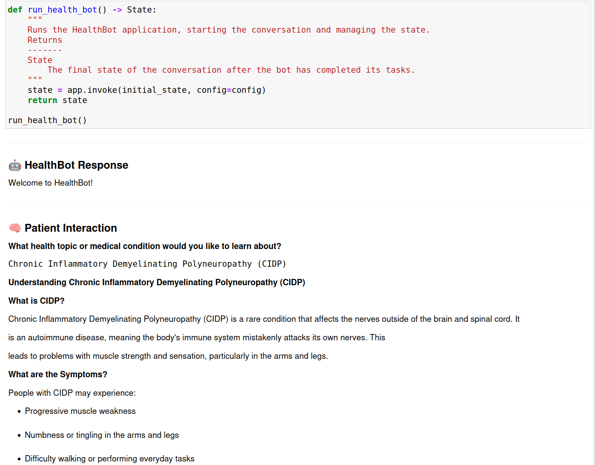

# HealthBot: AI-Powered Patient Education System

HealthBot is an interactive conversational agent designed to support patient education by providing medically accurate summaries and assessing user comprehension through automated question generation. The system is built using LangGraph and LangChain, integrates Tavily for information retrieval, and uses OpenAI models to generate human-readable summaries and feedback.

## Technologies

     


## Features

- Automated retrieval of medical information via the Tavily API
- Patient-friendly summarization using the OpenAI GPT model
- Generation of a single multiple-choice comprehension question based on the provided summary
- Grading of the patient's response with a letter score and explanatory feedback
- Interactive, step-by-step flow within a Jupyter Notebook
- Optional restart of the flow with related medical topics

## Jupyter Notebook Interface

The application runs entirely within a Jupyter Notebook, with Markdown-enhanced interaction, streaming responses, and structured outputs.



## Requirements

- Python 3.9 or later
- A valid OpenAI API key
- A valid Tavily API key

## Installation

1. Clone the repository:

```bash
git clone https://github.com/your-username/healthbot.git
cd healthbot
```

2. Set up a virtual environment and install dependencies:

```bash
python -m venv venv
source venv/bin/activate  # On Windows: venv\Scripts\activate
pip install -r requirements.txt
```

## Configuration

Create a file named `config.env` in the same directory as the notebook. This file should contain the API keys:

```
OPENAI_API_KEY="sk-..."
TAVILY_API_KEY="tvly-..."
```

Load the configuration at runtime using:

```python
from dotenv import load_dotenv
load_dotenv("config.env")
```

## Usage

1. Open `healthbot.ipynb` using Jupyter Notebook or JupyterLab.
2. Execute all cells to initialize the application.
3. Follow the interactive prompts:

   * Enter a medical topic of interest
   * Read the generated summary
   * Confirm readiness for a comprehension check
   * Answer the generated question
   * Review your grade and feedback
   * Choose whether to explore another topic or exit


